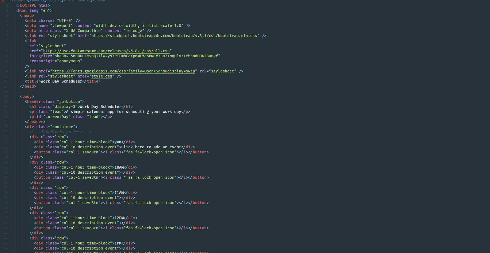
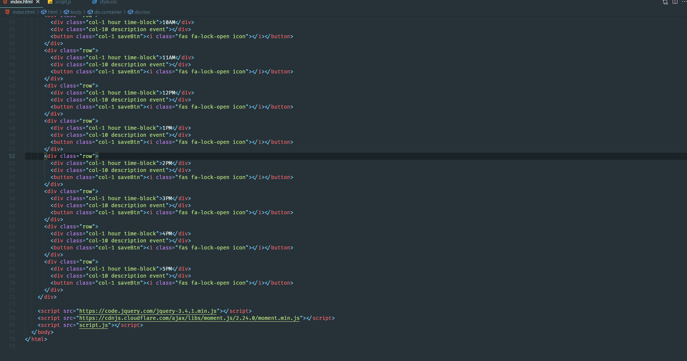
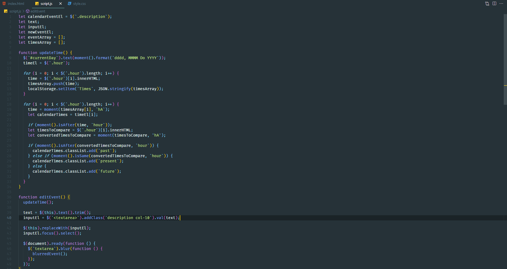
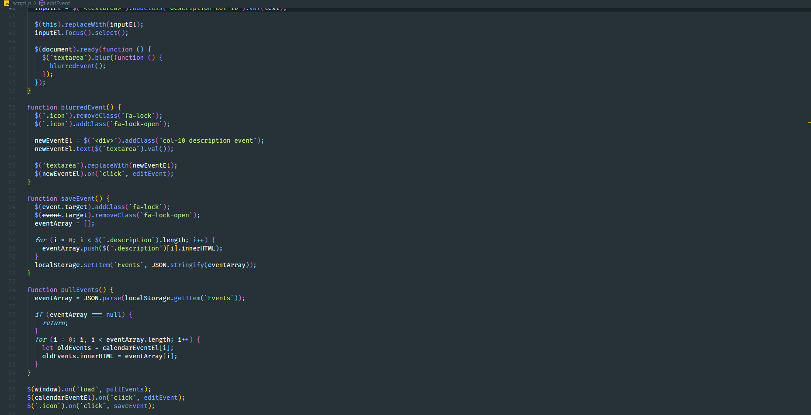
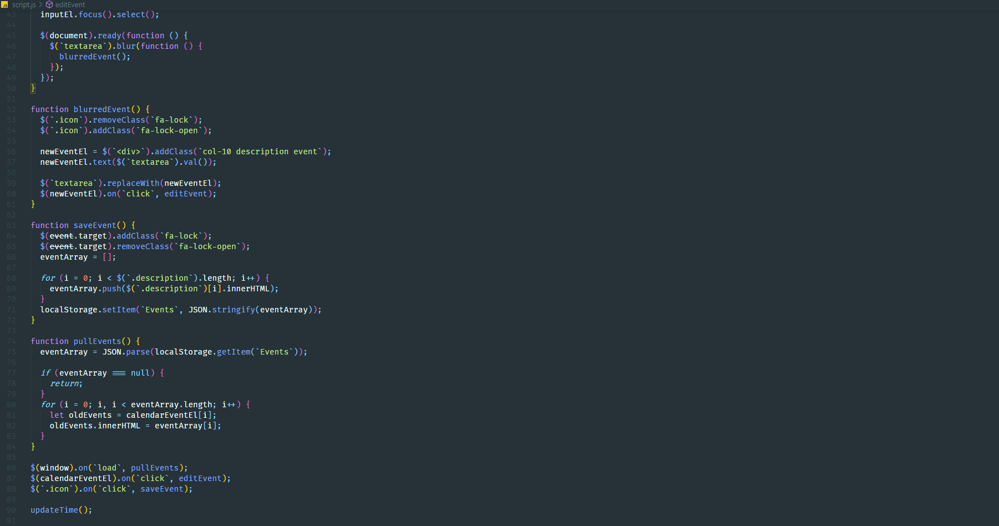

# Work Day Scheduler

## Description

In this challenge jquery and moment.js were used to create a work day planner that allows the user to create events for each hour, indicate if the hour has passed, is taking place, or is in the future and persists on the page when it is reloaded, if the task is saved.

## Screenshots

### Html

### Js/Jquery

## Links

https://lclark31.github.io/Calendar-app/
